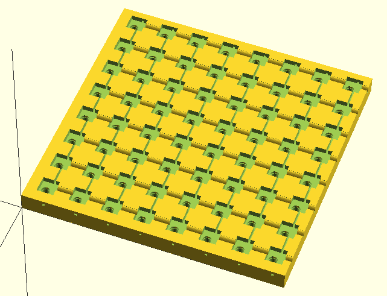
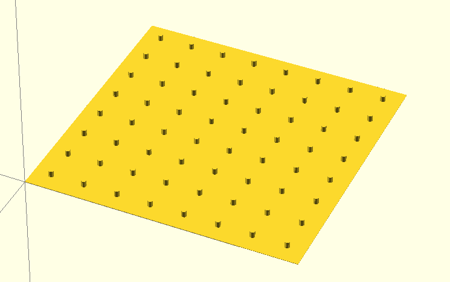
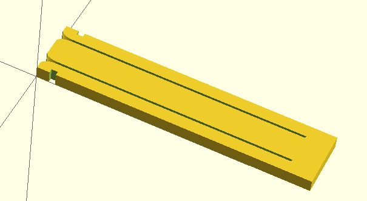

# LED Cube

Jigs for building a 3D cube.

## config.scad

All the configuration parameters are here, including the LED spacing, number of
rows and columns, size of the LEDs.

## guide.scad

A plate for soldering together the LEDs from a layer.

## popper.scad

Used to pop the LEDs out of the guide.

## stacker.scad

Use two or three to separate two layers while solder the layers together.

